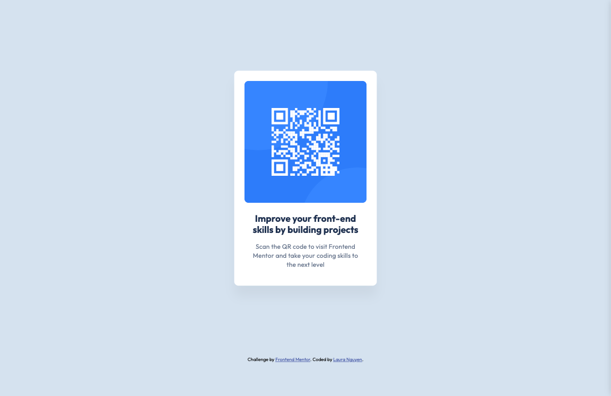

# Frontend Mentor - QR code component solution

This is a solution to the [QR code component challenge on Frontend Mentor](https://www.frontendmentor.io/challenges/qr-code-component-iux_sIO_H). Frontend Mentor challenges help you improve your coding skills by building realistic projects.

## Table of contents

- [Overview](#overview)
  - [Screenshot](#screenshot)
  - [Links](#links)
- [My process](#my-process)
  - [Built with](#built-with)
  - [What I learned](#what-i-learned)
  - [Continued development](#continued-development)
  - [Useful resources](#useful-resources)
- [Author](#author)

**Note: Delete this note and update the table of contents based on what sections you keep.**

## Overview

This is the first challenge for someone new to HTML and CSS. The task is to build out this QR code component and make it look as close to the design as possible. I decided to take on this challenge because, although I would say I'm past the beginner level for HTML and CSS, I wanted to practice Sass and ensure my code is readable and DRY (don't repeat yourself).

### Screenshot




### Links

- Solution URL: [Github Repo](https://github.com/laura-nguyen/qr-code-component)
- Live Site URL: [Live Site](https://laura-nguyen.github.io/qr-code-component/)

## My process

- Added content to the HTML
- Styled fonts with line height and font weight
- Defined variables for color and padding
- Added class names to HTML elements
- Applied styles

### Built with

- Semantic HTML5 markup
- Sass
- Flexbox
- CSS Grid
- Mobile-first workflow

### What I learned

I learned best practices for structuring styles with Sass to keep everything organized. I used separate SCSS files for global styles, mixins, typography, and variables. I also used mixins and extends to keep the code DRY.

```css
%outfit-bold {
  font-size: 1.375rem;
  line-height: 120%;
  font-weight: $font-weight-700;
  color: $slate-900;
}

%outfit-regular {
  font-size: 0.9375rem;
  line-height: 140%;
  font-weight: $font-weight-400;
  letter-spacing: 0.0125rem;
  color: $slate-500;
}
```

### Continued development

I eventually want to learn other front-end tools like Tailwind CSS to style more efficiently.

### Useful resources

- [SASS mixin, function and extend Comparison](https://medium.com/@tugbaakyolsener/sass-mixin-function-and-extend-comparison-d9fe6469efdf) - This resource helped me figure out how to utilize Sass to its fullest.

## Author

- Website - [Laura Nguyen](https://www.your-site.com)
- Frontend Mentor - [@laura-nguyen](https://www.frontendmentor.io/profile/laura-nguyen)
- Github - [@laura-nguyen](https://www.github.com/laura-nguyen)
- Twitter - [@lauriananguyen](https://www.twitter.com/lauriananguyen)
